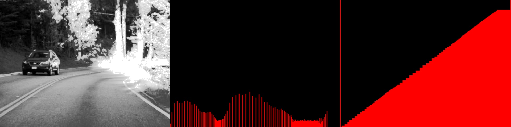
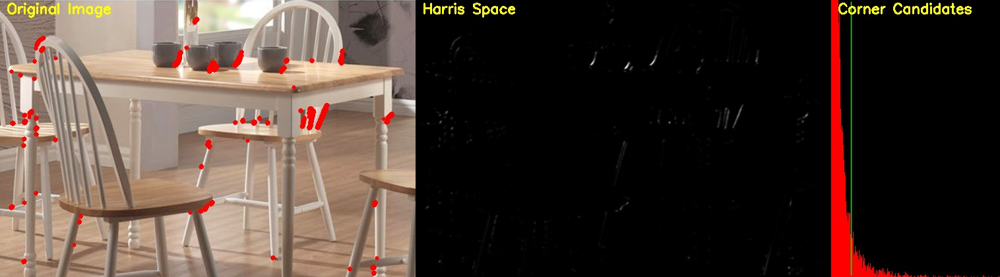

# Image-Processing
Image processing implementation with OpenCV library and C++ only

Compile : g++ -std=c++11 file_name.cpp -o program $(pkg-config --libs --cflags opencv)

1. Equalize Histogram

2. Harris Corner Detector

3. (Continued)
